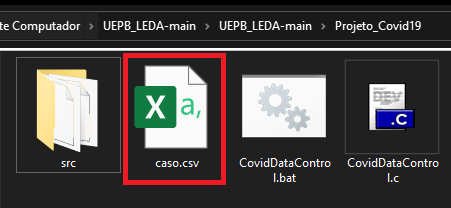

# Análise comparativa de algoritmos de ordenação aplicado a dados da COVID-19

Projeto para Analisar e Ordenar os dados (de um arquivo.csv) referentes a Covid-19 com base nas cidades, Nº de pessoas e de óbitos. 

## [*] Como Executar:

1. Para ser Executado corretamente, é necessario que seja instalado uma versão do Java JDK 1.8 ou superior.
 a instalação do JDK pode ser realizada diretamente no [site oficial da Oracle.](https://www.oracle.com/br/java/technologies/javase/javase-jdk8-downloads.html)
 
2. Baixe esse repositório do GitHub em sua máquina [(zip)](https://github.com/allen080/CovidDataControl/archive/refs/heads/main.zip).
3. Crie uma conta no site do dataset [https://brasil.io)(https://brasil.io/auth/entrar).
4. Entre na sua conta criada e faça download do dataset em [caso.csv](https://brasil.io/dataset/covid19/caso/?is_last=True&format=csv) **(OBS: o dataset foi previamente filtrado para conter apenas os dados mais recentes (É a ultima atualização? = True).**
5. Renomeie o dataset baixado para **caso.csv**. 
6. Insira o arquivo **caso.csv** na Pasta **CovidDataControl**.
	
9. Com isso, o programa poderá ser executado das seguintes formas:

	- **Atalhos Executavéis:**
		- **Windows:** Dando 2 cliques nos arquivos *CovidDataControl.exe*, *CovidDataControl.bat* ou *CovidDataControl . py (Se possuir o [python](https://www.python.org/downloads) no computador).*
		-  **Linux/OSX:** Executando no terminal na pasta **CovidDataControl** com python CovidDataControl. py ou bash CovidDataControl. sh.

	- **Terminal/CMD:**
		- Abrindo o Prompt do seu sistema, indo até o diretorio **CovidDataControl/src** e executando o comando: 
			- javac Main.java && java Main
	- **IDE's:**
		- Criando um projeto na IDE de sua preferência (que ofereça suporte a linguagem Java) e atribuindo os arquivos contidos na pasta **CovidDataControl/src** ao projeto.

## [*] Funcionalidades:
1. O programa ordenará os dados do **caso.csv** considerando o arquivo original (médio caso), o arquivo invertido (pior caso) e o arquivo previamente ordenado (melhor caso).

3.  As ordenações serão realizadas com base no numero total de casos confirmados do dataset, no número de óbitos registrados e no nome das cidades.
4. No caso padrão (médio caso) o programa escreverá os dados em arquivos .csv que ficará na pastaDoProjeto/DadosOrdenados/MedioCaso **(OBS: no PiorCaso e no MelhorCaso, os dados não serão escritos por não haver necessidade de repetição já que serão os mesmos dados obtidos pelo MedioCaso, apenas será feito para contalibizar o tempo).**
5. Ao final dos 3 casos de ordenações, será exibido uma tabela com o tempo realizado para cada um dos algoritmos de ordenação (a tabela completa estará disponível ao final do programa em **CovidDataControl/DadosOrdenados/TimesExecution.txt**).
